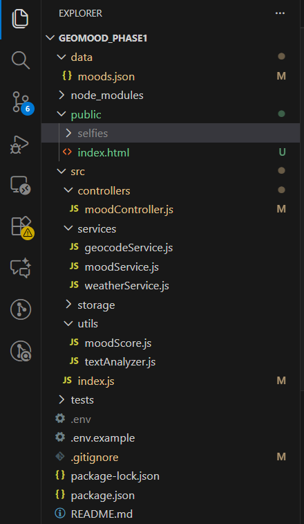

PHASE 1
🔹 Pourquoi on a créé ces services

Le projet GeoMood Map+ veut cartographier l’humeur d’un utilisateur en combinant trois dimensions :

Le ressenti émotionnel (texte + note d’humeur + éventuellement image)

La localisation (lieu exact, type de lieu)

La météo réelle au moment du ressenti

Pour ça, il faut des informations externes, qu’on ne peut pas générer nous-mêmes. C’est là que les services entrent en jeu :

1️⃣ Service météo (weatherService.js)

Objectif : récupérer la météo actuelle pour un lieu précis.

Entrée : latitude et longitude de l’utilisateur

Sortie : température, humidité, vent, description météo

💡 Exemple d’usage :

L’utilisateur dit “Je suis heureux au parc” → on récupère sa position (lat/lon)

On appelle getWeather(lat, lon) → on obtient “15°C, pluie légère, humidité 82%”

Ces données seront utilisées pour calculer le MoodScore et éventuellement pour visualiser sur la carte.

2️⃣ Service géocode (geocodeService.js)

Objectif : transformer des coordonnées en nom/type de lieu et inversement.

reverseGeocode(lat, lon) : lat/lon → nom du lieu + type (ex : “Parc Mock”, type: “park”)

forwardGeocode(address) : adresse → lat/lon + type

💡 Exemple d’usage :

L’utilisateur poste sa note d’humeur depuis le parc → on récupère “Parc des Buttes-Chaumont”, type “park”

Permet d’afficher correctement le lieu sur la carte, et de faire des statistiques par type de lieu.

3️⃣ Pourquoi on a des mocks ?

Si tu n’as pas encore de clé API OpenWeatherMap ou Google Cloud, les services renvoient des données simulées (mock).

Ça permet de tester l’application et l’interface sans dépendre des APIs externes.

Quand tu mets USE_MOCKS=false et que tu as les clés, les vrais services sont utilisés.

#CI / GitHub Actions

Assurez de committer .github/workflows/ci.yml (fourni). À chaque push/PR, GitHub Actions va :

installer node

npm ci

npm test

Vérifiez qu’une première exécution est verte.

Rappel : Chaque fichier
📌 1. index.js
    👉 index.js (fichier principal du serveur, à la racine du projet)
    C’est généralement le fichier où :

    tu initialises Express (const app = express())

    tu déclares les routes (ex: /api/moods)

    tu démarres le serveur (app.listen())

    ➡️ C’est le point d’entrée de ton backend.

📌 2. controllers/
    👉 Les controllers gèrent la logique liée aux routes API.
    Ils reçoivent les requêtes HTTP et appellent les services.

    Exemple : moodController.js

    reçoit la requête POST /api/moods

    valide les données

    appelle moodService pour enregistrer l’humeur

    renvoie une réponse JSON

    ➡️ C’est l'interface entre Express et la logique métier.

📌 3. services/

    👉 Les services contiennent la logique métier (business logic).
    Ils ne connaissent pas Express.

    Exemple :

    📍 geocodeService.js

        prend une adresse ou des coordonnées

        appelle une API (ex: OpenCage, Google, Nominatim)

        retourne latitude/longitude

    📍 weatherService.js

        récupère la météo d’un lieu (ex: météo actuelle)

        utilisé probablement pour enrichir les moods (contexte météo)

    ➡️ Les services = cerveau du backend.

📌 4. storage/

    👉 Contient la partie persistance (sauvegarde des données).

    📍 jsonStore.js

    lit le fichier moods.json

    écrit dans moods.json

    encapsule les opérations fichier :

    read()

    write()

    push()

    find()

    ➡️ C’est ta base de données maison en JSON.

📌 5. utils/

    👉 Contient des outils généraux, indépendants des controllers et services.

    📍 moodScore.js

    Probablement un calculateur de score :

    score global d’un mood

    normalisation

    coefficients météo / humeur

    ➡️ Ce sont les fonctions réutilisables partout.

📌 6. data/

    👉 Contient les données persistées.

    📍 moods.json

    stocke tous les moods enregistrés

    sert de petite base de données JSON

    lu et écrit par jsonStore.js

    ➡️ Equivalent d'une table Mood dans une vraie base.

📌 7. tests/

    👉 Tes fichiers de tests unitaires, très bien organisés :

    ➡️ Tes tests garantissent que ton code reste fiable.

*********************************************************************************************************

1️⃣ index.js (serveur principal)

    Rôle : Point d’entrée du serveur Node/Express.

    Ce qu’il fait :

        Charge les variables d’environnement (dotenv).

        Configure Express (app.use(express.json())).

        Sert les fichiers statiques du dossier public (index.html, CSS, JS côté client…).

        Définit l’API pour l’autocomplete : /api/search → appelle geocodeService.forwardGeocode.

        Définit les routes principales pour les moods :

            POST /api/moods → appelle addMood dans moodController.

            GET /api/moods → appelle getMoods dans moodController.

        Gère les 404 et les erreurs serveur.

2️⃣ controllers/moodController.js

    Rôle : Logique métier pour la gestion des moods (ajout et récupération).

    Ce qu’il fait :

        addMood(req, res)

            Valide les données du formulaire (text, rating, lat/lon ou address).

            Si seulement address est fourni, utilise geocodeService.forwardGeocode pour obtenir les coordonnées.

            Si lat/lon sont fournis, utilise geocodeService.reverseGeocode pour obtenir l’adresse complète.

            Récupère la météo avec weatherService.getWeather(lat, lon).

            Analyse le texte avec textAnalyzer.analyzeText(text) pour un score de sentiment.

            Calcule le score final avec moodScore.computeScoreWithBreakdown.

            Sauvegarde dans le JSON via jsonStore.save.

            Retourne l’objet mood au frontend.

        getMoods(req, res)

            Lit tous les moods via jsonStore.loadAll() et renvoie au frontend.

3️⃣ services/geocodeService.js

    Rôle : Transformation entre adresse ↔ coordonnées.

    forwardGeocode(address) → adresse → { lat, lon, name }.

    reverseGeocode(lat, lon) → coordonnées → { name, lat, lon }.

    Utilisé par moodController et /api/search (autocomplete).

4️⃣ services/weatherService.js

    Rôle : Récupère la météo via OpenWeatherMap ou mock.

    Appelé uniquement dans addMood pour enrichir l’humeur avec la météo.

5️⃣ storage/jsonStore.js

    Rôle : Sauvegarde et lecture des données JSON (data/moods.json).

    Méthodes :

        save(entry) → ajoute un mood.

        loadAll() → récupère tous les moods.

    Appelé uniquement par moodController.

6️⃣ utils/moodScore.js

    Rôle : Calcule un score final d’humeur.

    Appelé par addMood.

7️⃣ utils/textAnalyzer.js

    Rôle : Analyse le texte de l’utilisateur pour en extraire un score positif/négatif.

    Appelé par addMood.

🔄 Flux complet :

Frontend (public/index.html) :

    Formulaire rempli → fetch('/api/moods', POST)

    Autocomplete adresse → fetch('/api/search?q=...')

Serveur (index.js) :

    Reçoit la requête → appelle le controller correspondant.

Controller (moodController.js) :

    Valide les données.

    Appelle services :

        geocodeService pour l’adresse.

        weatherService pour la météo.

        textAnalyzer pour analyser le texte.

    Appelle computeScoreWithBreakdown pour le score.

    Appelle jsonStore.save pour enregistrer le mood.

Backend → Frontend :

    Retourne la réponse JSON pour afficher le mood ou l’autocomplete.

✅ Conclusion :

    Tous tes fichiers sont utiles.

    index.js orchestre tout.

    Les services (geocodeService, weatherService) sont des utilitaires pour le controller.

    Le controller centralise la logique et la sauvegarde.

    